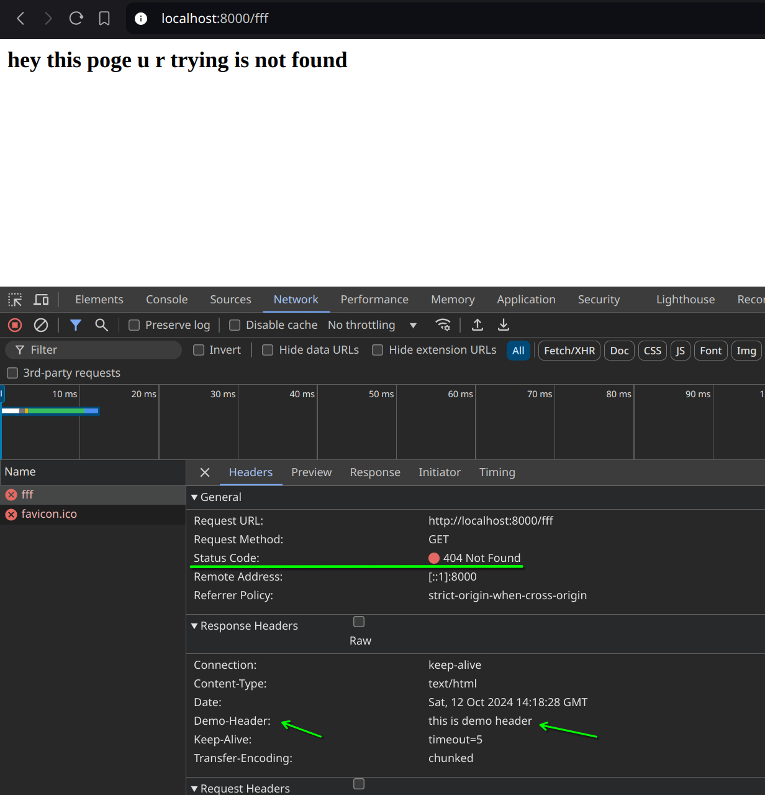

## Routing


``` js
const server  = http.createServer((req, res) => {
    // console.log(req.url)
    const pathName = req.url

    if (pathName === "/" || pathName === "/overview"){
        res.end("Hello from overviews")
    }
    else if (pathName === "/product"){
        res.end("this is product pages")
    }

    else{
        res.writeHead(404, {
            'content-type' : 'text/html',
            'demo-header': 'this is demo header'
        } );
        res.end("<h2>hey this poge u r trying is not found</h2>")
    }
})
```

output:



## please note that you start reading code from 01`<somename>`.js, 02`<somename>`.js, ... last file is the index.js
